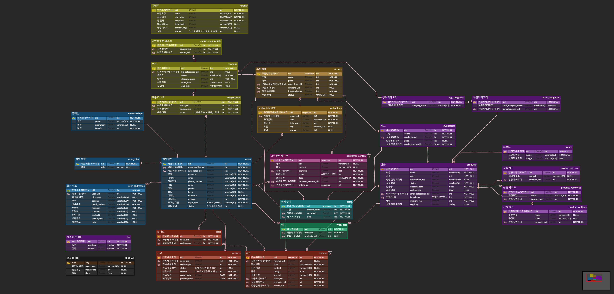

# AbuyZ - A부터 Z까지 모든 상품을 구매하다


</br>

## 링크(PC only) : [abuyz 홈페이지](https://k7e201.p.ssafy.io/)

## AbuyZ UCC : [UCC 링크](https://drive.google.com/drive/folders/1WxadCBLbcmJUC3Xa5VF8ksiMUPI9vVpw)

</br>

## 📆 프로젝트 진행 기간

2022.10.10(월) ~ 2022.11.21(월)  - 6주
SSAFY 7기 2학기 자율 프로젝트 - AbuyZ

</br>

## ✔ 팀원 역할 분배

---

|   Name   | 권도건                              | 공지훈                                    | 김동우                                    | 박유주                              | 장창완                                          | 최지은                                      |
| :------: | ----------------------------------- | ----------------------------------------- | ----------------------------------------- | ----------------------------------- | ----------------------------------------------- | ------------------------------------------- |
| Profile  |  |        |        |  |              |          |
| Position | 팀장 & Frontend & UI/UX             | Backend Develop & CI/CD & UCC             | Backend Develop & CI/CD                   | Backend Develop & CI/CD             | Frontend & UI/UX                                | Frontend & UI/UX                            |
|   Git    | [doogun](https://github.com/doogun) | [Jihun0224](https://github.com/Jihun0224) | [ehddn5252](https://github.com/ehddn5252) | [9Yuju](https://github.com/9Yuju)   | [jangchangwan](https://github.com/jangchangwan) | [zzieunchoi](https://github.com/zzieunchoi) |

</br>

## 🏅 AbuyZ - 배경

*-쇼핑몰 플랫폼-*

**AbuyZ 는 판매자, 소비자가 모두 사용할 수 있는 플랫폼입니다.**

유통 도메인에 대한 지식을 만들고자 쇼핑몰 플랫폼을 만들기 시작했습니다. 

더군다나 40:1의 경쟁률을  뚫고 실제 유통 사업을 진행하고 있는 **롯데정보통신과 함께 SI 프로젝트**를 진행했습니다.

6주만에 만들어진 쇼핑몰 플랫폼. 어떤 것을 구매하고 싶으신가요? 혹은 어떤 상품을 판매하고 싶으신가요?

AbuyZ와 함께 재밌는 쇼핑을 시작하세요.

</br>

## ✔ AbuyZ 기능

- #### 소비자(FO)
  - 회원
    - 개인 정보(Id, E-mail, Password, Phone number, birthday) 을 입력 받아 회원 가입
    - 해당 메일로 인증번호를 발송하여 유효한 이메일인지 인증
    - 로그인한 회원 정보 삭제
    - 본인 정보(ID , Password)로 로그인
    - Kakao 계정으로 로그인
    - 세션 스토리지에 남아 있는 고객정보를 삭제
    - 회원가입 시 입력한 아이디 및 전화번호를 통해 비밀번호를 찾을 수 있다.
    - 회원 정보(Password, Phone number, birthday) 수정
    - 회원 정보, 구매 내역 조회
  - 상품
    - 메인에 보여줄 상품 조회
    - 상품 카테고리 목록 조회
    - 상품 정보( 이미지, 가격, 설명, 리뷰, 할인 정보) 조회
    - 구매한 상품에 대한 리뷰(내용, 평점) 등록
    - 내가 작성한 리뷰에 대한 삭제
    - 판매자가 댓글에 대한 대댓글 등록
  - 검색
    - 상품명 기반 상품 조회
    - 카테고리에 해당하는 상품 조회
    - 각 카테고리별 개별 필터링을 통한 상품 조회
  - 고객센터
    - 환불 / 상품문의 / 배송문의 등 카테고리 조회
    - 고객이 질문을 등록할 수 있는 페이지로 이동하는 버튼
    - 본인이 작성한 글 아래의 삭제 버튼을 클릭하면 질문 삭제, 질문이 삭제되면 아래에 작생된 댓글도 삭제
    - 작성된 글 아래의 질문 답변 옆에 삭제 버튼을 누르면 댓글 작성한 본인만 삭제 가능
    - 본인이 작성한 질문에 답변이 달리면 알림이 옴
  - 주문결제
    - 옵션 리스트에서 원하는 옵션 선택
    - 해당 상품을 장바구니 리스트로 이동
    - 구매하기 전 상품을 모아놓는 장바구니 기능
    - 각 상품 옆에 장바구니에서 제거 버튼 
    - 배송지 정보 입력시, 성함, 우편번호, 우편번호 검색, 주소, 상세주소, 연락처 조회 가능
    - 갖고 있는 쿠폰 중에 선택하는 기능
    - 선택된 쿠폰 사용하는 기능
    - 선택한 쿠폰의 사용을 취소하는 기능
    - 간편 결제할 수 있는 기능 - 카카오페이
  
- #### 판매자
  - 회원
    - 회원가입 시 입력한 아이디, 비밀번호로 로그인 가능
    - 아이디, 비밀번호, 이름, 전화번호, 생년월일, 사업장 소재지, 이메일 확인 가능
  - 상품
    - 제품의 정보를 등록할 수 있음 : 제품명, 색상, 구매 수량 단위, 사이즈, 대표 사진 등 
    - 제품에 맞는 가격을 등록할 수 있음(원화 기준)
    - 검색하기 위한 간단한 키워드 등록 가능
    - 제품명, 사진, 가격, 키워드를 스크롤 형식으로 확인 가능
  - 전시
    - 메인 페이지에 양식에 맞는 배너 등록, 수정, 조회, 삭제 가능
    - 다양한 상품 할인 정책을 등록, 수정, 조회, 삭제 할 수 있음
  - 고객센터
    - 고객센터 페이지에 올라간 모든 글 가져오기(제목)
    - 자신이 등록한 고객센터 글 모두 가져오기(제목)
    - 고객의 글 등록하기 (제목, 카테고리, 내용)
    - 구매자가 자신이 등록한 글 삭제하기
    - 고객이 고객센터 쓴 글을 클릭하면 답변도 같이 보이게 됩니다. (답변 내용)
    - 고객이 등록한 글에 대한 답글의 내용을 삭제합니다.(답변 내용, 등록되었다는 체크 표시 취소)
  - 주문 / 결제
    - 고객이 주문한 주문 현황 리스트를 보여줍니다.(구매 상품 이미지, 상품 정보(상품 링크), 수량,  상품 금액, 배송정보, 취소 가능 정보)
    - 구매자가 구매한 주문 상태를 가 취소 가능일 시에 상품을 삭제하고 결제한 금액을 고객에게 반환됩니다.
    - 판매자 매출 정보를 보드형식으로 보여줍니다..(전체 매출, 어제 매출, 오늘 매출, 주간 매출, 판매 상품, 수익률 그래프)
    - 구매자가 판매자의 상품을 구매, 취소할 시 매출 정보를 다시 DB에 다시 계산할 수 있도록 수정합니다.

</br>

## ✔ 개발 환경

---

**OS**

* Windows 10

**IDE**

* IntelliJ 2021.3.2
* Visual Studio Code 1.70.1
* UI/UX: Figma

**Database**

* MySQL 8.0.30
* Redis 7.0.4

**server**

* AWS EC2 Ubuntu 20.04 LTS

**Dev-Ops**

* Docker 20.10.17
* Jenkins 2.60.3

**Backend**

- Spring boot 2.7.2

- Open JDK 8

- Gradle 7.5

- dependencies

  ```
  spring-boot-starter-data-jpa:2.7.5
  spring-boot-starter-security:2.7.5
  spring-boot-starter-validation:2.7.5
  spring-boot-starter-web:2.7.5
  mysql-connector-java:8.0.31
  Lombok:1.18.24
  commons-io:2.6
  commons-fileupload:1.4
  spring-cloud-starter-aws:2.2.6
  jjwt-api:0.11.2
  jjwt-impl:0.11.2
  jjwt-jackson:0.11.2
  json-simple:1.1.1
  spring-boot-starter-mail:1.2.0
  spring-boot-starter-data-redis:2.7.5
  querydsl-jpa:5.0.0
  querydsl-apt:5.0.0
  ```

**Frontend**

- Next.js 12.3.1
- React 18.2.0
- Recoil 0.7.6
- Slick-carousel 1.8.1
- Styled-component 2.8.0
- MUI 5.10.9
- Axios 1.1.3
- React-dropdown 1.11.0
- React-scroll 1.8.8
- React-is-pagination 3.0.3
- React-datepicker 4.8.0
- Prettier 2.7.1
- Moment 2.29.4
- Lodash 4.17.21
- Jquery 3.6.1
- Cors 2.8.5

</br>

## ✔ 프로젝트 파일 구조

---

### Frontend

```
front
├─.next
├─components
│   ├─admin
│   ├─event
│   ├─main
│   ├─mypage
│   ├─nav
│   ├─payment
│   ├─product
│   └─service
├─node_modules
├─pages
│   ├─admin
│   │  ├─product
│   │  │  ├─add.js
│   │  │  └─index.js
│   │  ├─user
│   │  │  ├─ask.js
│   │  │  ├─faq.js
│   │  │  ├─report.js
│   │  │  └─review.js
│   │  ├─account.js
│   │  ├─chart.js
│   │  ├─coupon.js  
│   │  ├─dashboard.js
│   │  └─event.js
│   ├─api
│   ├─detail
│   │  └─[id].js
│   ├─event
│   │  ├─index.js
│   │  └─[id].js
│   ├─_app.js
│   ├─_document.js
│   ├─basket.js
│   ├─index.js
│   ├─login.js
│   ├─mypage.js
│   ├─payment.js
│   ├─pwf.js
│   ├─search.js
│   ├─service.js
│   └─signup.js
├─public
│   └─images
│      ├─ABUYZ_LOGO.png
│      ├─...
│      └─water.png
├─states
│   └─index.js
└─styles
```

### Backend

```
backend
 ┣ .gradle
 ┣ .idea
 ┣ build
 ┣ gradle
 ┣ src
 ┃ ┣ main
 ┃ ┃ ┣ java
 ┃ ┃ ┃ ┗ com
 ┃ ┃ ┃ ┃ ┗ tasteshopping
 ┃ ┃ ┃ ┃ ┃ ┣ domain
 ┃ ┃ ┃ ┃ ┃ ┃ ┣ controller
 ┃ ┃ ┃ ┃ ┃ ┃ ┣ dto
 ┃ ┃ ┃ ┃ ┃ ┃ ┣ entity
 ┃ ┃ ┃ ┃ ┃ ┃ ┣ exception
 ┃ ┃ ┃ ┃ ┃ ┃ ┣ repository
 ┃ ┃ ┃ ┃ ┃ ┃ ┗ service
 ┃ ┃ ┃ ┃ ┃ ┣ common
 ┃ ┃ ┃ ┃ ┃ ┃ ┣ dto
 ┃ ┃ ┃ ┃ ┃ ┃ ┃ ┗ BaseRes.java
 ┃ ┃ ┃ ┃ ┃ ┃ ┣ Exception
 ┃ ┃ ┃ ┃ ┃ ┃ ┃ ┗ NotFoundException.java
 ┃ ┃ ┃ ┃ ┃ ┃ ┗ service
 ┃ ┃ ┃ ┃ ┃ ┃ ┃ ┣ ImageUploadService.java
 ┃ ┃ ┃ ┃ ┃ ┃ ┃ ┣ RedisService.java
 ┃ ┃ ┃ ┃ ┃ ┃ ┃ ┗ UtilService.java
 ┃ ┃ ┃ ┃ ┃ ┣ config
 ┃ ┃ ┃ ┃ ┃ ┃ ┣ AmazonS3Config.java
 ┃ ┃ ┃ ┃ ┃ ┃ ┣ PropertyConfig.java
 ┃ ┃ ┃ ┃ ┃ ┃ ┣ QuerydslConfig.java
 ┃ ┃ ┃ ┃ ┃ ┃ ┣ RedisConfig.java
 ┃ ┃ ┃ ┃ ┃ ┃ ┗ SecurityConfig.java
 ┃ ┃ ┃ ┃ ┃ ┗ AbuyzApplication.java
 ┃ ┃ ┗ resources
 ┃ ┃ ┃ ┣ application.properties
 ┃ ┃ ┃ ┗ spring_key.p12
 ┃ ┗ test
 ┣ .gitignore
 ┣ build.gradle
 ┣ Dockerfile
 ┣ gradlew
 ┣ gradlew.bat
 ┗ settings.gradle
```

</br>

## ✔ 협업 툴

---

- [Gitlab](https://lab.ssafy.com/s07-final/S07P31E201)
- [Notion](https://www.notion.so/abuyz-f445b44735144a22bf7fc0e61646cfb3)
- [JIRA](https://ssafy.atlassian.net/jira/software/c/projects/S07P31E201/boards/16)
- [Figma](https://www.figma.com/file/vUtUZUd0iGN6nALJAdJNk1/%EB%A1%AF%EB%8D%B0%EC%A0%95%EB%B3%B4%ED%86%B5%EC%8B%A0-%ED%94%84%EB%A1%9C%EC%A0%9D%ED%8A%B8---AbuyZ?t=sUJWEDxMIXVVthAg-0)
- MatterMost
- Webex

</br>

## ✔ 협업 환경

- Gitlab
  - 코드 버전 관리

  - MR 템플릿 사용

  - 기능별 branch 생성, 개발.

  - 커밋 컨밴션

    ```
    ✨ `:sparkles:` / 새로운 기능 추가, 구현 feat
    🐛 `:bug:` / 버그 수정 fix
    ♻️ `:recycle:` / 코드 리팩토링 refactor
    ✅ `:white_check_mark:` / 테스트 test
    👽 `:alien:` / API 변경
    💄 `:lipstick:` / UI, 스타일 관련 파일 추가 및 수정
    🗒️ `:memo:` / 문서 파일 추가 및 수정
    🚚 `:truck:` / 파일이나 폴더명 수정 및 이동
    🔥 `:fire:` / 파일 및 코드 삭제
    💎 `:gem:` / 새로운 배포
    ⚓ `:anchor:` / 이 외 커밋
    - ':이모지태그: 내용' 형태 이며, : 뒤에 SPACE
      - ex)
      - git commit -m ‘`:bug:` 회원가입 버그 수정’
      - git commit -m ‘`:alien:` 상품 API 변경’
    - 지라 이슈 번호가 있는 기능이라면!
      - git commit -m ‘[S07P31E201-18]`:sparkles:` 로그인 기능 구현’
    ```

- JIRA
  - 개발 기획에 따라 에픽, 이슈 생성
  - 매주 첫 워킹데이에 개인 목표량을 설정하여 Sprint 진행
  - 업무의 우선순위를 설정하고, 할당량을 정하여 Story Point를 설정한 뒤 In-Progress -> Done 순으로 작업
  - 소멸 차트를 통해 스프린트 진척도 확인

- 회의
  - 매일 아침 스크럼 진행, 진행 중인 내용 및 이슈 공유
  - 프론트엔드 <-> 백엔드 요구사항 소통
  - 매일 오후 스크럼 진행, 오늘 진행한 내용 공유

- Notion
  - 회의록/피드백/스크럼/상담내용 등 저장
  - 개발 참고 자료 업로드, 필요 개념 공유
  - 개발 도중 발생한 이슈 저장
  - 컨벤션 정리
  - 각종 명세서 등 모두가 공유해야 하는 문서 관리

- Figma
  - 목업 제작, 와이어프레임제작, 디자인 작업 공유


## ✔ 프로젝트 산출물

* 기능명세서
  * [BO 기능명세서](https://www.notion.so/b88ed8f3d21d429ab91c3a0f6dc7a883?v=09fd5105c8624b9683081bc0ad2a208c)
  * [FO 기능명세서](https://www.notion.so/38d199726e8b4aaca3befe60cdb86e79?v=518cff6534a144f982e0e15ea8d11d54)

* 플로우차트

  

* ERD

  

* [API](https://documenter.getpostman.com/view/23948135/2s84LGWEyN#7d5e4ec4-03f1-4b90-a3da-ab102d916684)

* [테스트케이스](https://docs.google.com/spreadsheets/d/13ITEDllVdZluCJMKbZlF9TbzYsfVCOCz5YpIXORRWJc/edit#gid=1386834576)


## ✔ 프로젝트 결과물

* [포팅매뉴얼](exec/AbuyZ_포팅 매뉴얼.pdf)
* [중간발표자료](docs/중간발표.pptx)

- [최종발표자료](docs/최종발표.pptx)


## 🎵 AbuyZ 서비스 화면

## FO

### 메인화면

- 이벤트 캐루젤
- 카테고리 별 이동
- 추천 상품과 az 배송 상품 랜덤 조회


### 로그인

* 아이디와 비밀번호 입력 후 로그인 가능
* 카카오 로그인도 가능


### 회원가입

* 이메일, 비밀번호, 비밀번호 확인, 이름, 휴대폰 번호, 주소, 성별, 닉네임, 생년월일 기입 후 회원 가입


### 마이페이지

- 상단
  - 처리중인 문의: 아직 답변 받지 못한 문의 내역 개수 조회
  - 사용 가능 쿠폰: 본인이 사용 가능한 쿠폰 조회 가능
  - 작성 가능 리뷰: 현재까지 구매했지만 아직 리뷰를 작성하지 못한 리뷰 조회 가능

* 주문내역
  * 현재까지 주문한 내역 조회 가능 - 재고 있다면 장바구니 담기 가능
* 찜한 상품 
  * 상품 오른쪽 상단의 하트를 누르면 상품 찜하기 가능 - 채워져있는 하트를 누르면 찜하기 취소 가능
* 문의 내역
  * 고객센터를 통해 문의한 내역 조회 가능
* 쿠폰
  * 본인이 사용 가능한, 사용완료한, 기간이 만료된 쿠폰 조회 가능
* 내 정보 관리
  * 개인 정보 수정 가능
* 배송지 관리
  * 본인의 배송지가 다양해질 경우를 대비해 따로 관리 - 배송지 추가, 수정, 삭제, 조회 가능


### 상품 검색

* 검색창을 통한 상품 검색 가능
* 카테고리 별 상품 조회 가능
* 신상품 : 최근 추가된 상품순
* 베스트: 가장 리뷰가 높은 상품순
* 알뜰 쇼핑: 가장 할인율이 높은 상품순
* 필터링 : 배송비, 가격 필터링 가능
* 검색한 상품 중 최근 등록 순, 가격 낮은 순, 가격 높은 순, 평점 높은 순, 리뷰 높은 순으로 정렬 가능


### 상품 상세 조회

* 상품 이미지, 이름, 옵션, 수량, 장바구니, 구매하기 가능

* 상세정보, 리뷰, 교환/ 반품 안내 클릭 - 각 버튼을 클릭하면 스크롤이동

* top 버튼 사용 가능

  


### 장바구니

- 장바구니에 담은 상품 조회

- 장바구니 수량 조정 가능


### 고객센터

- FAQ: AbuyZ의 공지 사항
- 1:1 문의하기: 상품, 환불, 배송, 사이트, 주문 결제 카테고리 선택해서 문의 가능
- 환불 카테고리 클릭 시 최근 7일내에 구매한(환불 가능한 상품) 상품 조회 가능
- 이미지 파일 첨부 가능


### 이벤트

- 이벤트 조회 가능
- 해당 이벤트에서 진행중인 쿠폰 발급 가능 - 쿠폰 발급 일자에 맞춰 쿠폰 발급
- 이미 발급받은 쿠폰이라면 발급 불가능


## BO

### 로그인

- admin 계정으로 로그인하면 바로 abuyz 셀러 오피스로 이동
- 대시보드: 오늘의 할일/ 일자별 요약/ 최근 문의/ 최근 리뷰가 보여짐


### 상품 조회

- 카테고리, 검색어, 판매상태, 기간으로 상품 조회
- 상품 속성 수정 가능


### 상품 등록

- 카테고리, 상품 이름, 할인율, 가격, 배송비, 브랜드, 키워드, 대표이미지, 추가이미지, 상세이미지 추가
- 옵션 선택/ 옵션 미선택 가능
  - 옵션 선택 클릭 시 - 옵션명과 옵션값을 입력하고 자동으로 옵션값에 해당하는 표가 만들어짐
  - 추가 가격과 재고를 입력 가능


### 문의 관리

- FO 페이지 1:1 문의에서 받은 문의에 대한 조회, 답변 가능


### 신고관리

- 상품 상세 조회 리뷰 중 신고 된 리뷰에 대한 관리 


### 리뷰 관리

- 상품에 대해 소비자가 작성한 리뷰에 대한 대댓글 작성 가능


### FAQ

- FO 페이지의 고객센터 - FAQ에 보여질 공지사항 CRUD 


### 이벤트

- 이벤트 조회
- 이벤트 수정 및 삭제
- 이벤트에 해당하는 쿠폰을 매칭


### 쿠폰

- 쿠폰 조회
- 쿠폰 등록, 수정 가능


### 통계

- 조회 기간을 설정하여 그 기간에 맞게 커스텀 된 총 매출현황, 요일별 결제금액, 카테고리별 판매비율, 상품별 결제금액, 장바구니 상품 비율 차트 조회 가능


